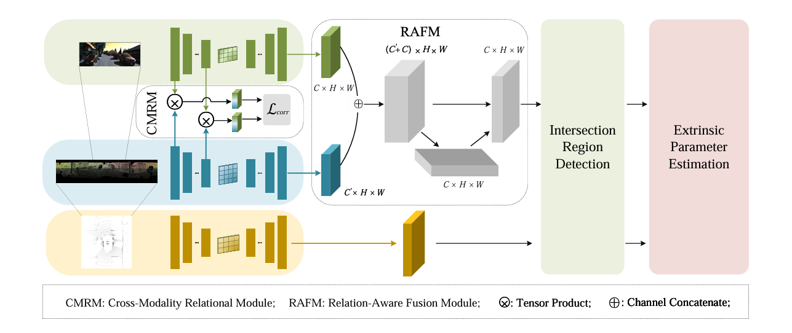
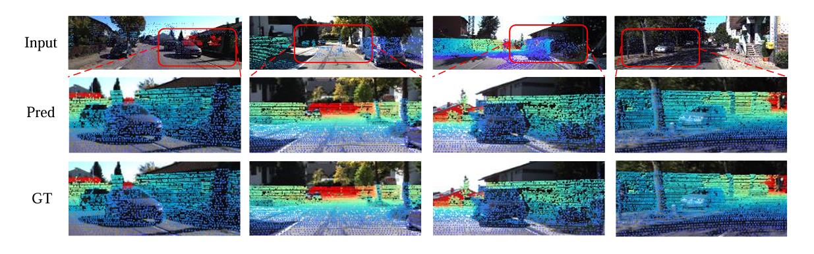

<p align="center">


  <h1 align="center">Differentiable Registration of Images and LiDAR Point Clouds with VoxelPoint-to-Pixel Matching </h1>
  <p align="center">
    <a href=""><strong>1st Minghui Hou</strong></a>
    ·
    <a href=""><strong>2nd Gang wang†</strong></a>
    ·
    <a href=""><strong>3rd Zhiyang Wang</strong></a>
    ·
    <a href=""><strong>4th Baorui Ma</strong></a>

  </p>
  <h2 align="center">ICASSP 2025</h2>
  <div align="center"></div>
</p>

## Overview
<p align="center">
  
</p>
we propose a novel Relational
 Learning for Image-to-Point cloud (RelaI2P) framework for
 cross-modality registration tasks. Specifically, we propose the
 Cross-Modality Relation Module (CMRM), which enables
 rich context exchange of features between images and point
 clouds for relational reasoning. Here, low-level and high-level
 features can provide relation information at different gran
ularities, respectively. Considering the differences in cross
modality data, we construct a Relation-Aware Fusion Module
 (RAFM) that integrates the context information of cross
modality features and their relations, thereby effectively utiliz
ing their benefits for relational reasoning. We evaluate RelaI2P
 on the KITTI dataset, showing that RelaI2P achieves state
of-the-art performance. The ablation study demonstrates the
 effectiveness of CMRM and RAFM. Our main contributions
 can be summarized as: 1). We propose the CMRM for image
to-point cloud registration, which captures the relational con
text information between features at different levels. 2). We
 propose a RAFM that effectively propagates features and the
 relational information. 3). We propose the RelaI2P framework
 for image-to-point cloud registration based on CMRM and
 RAFM, which outperforms state-of-the-art methods in exper
iments on the KITTI dataset.

## Registration Results
### KITTI
<p align="center">
  
</p>


## Feature Matching Results
<p align="center">
  
</p>


## Installation
Our code is implemented in Python 3.8, PyTorch 1.11.0 and CUDA 11.3.
- Install python Dependencies
```bash
conda create -n vp2p python=3.8
conda activate vp2p
conda install pytorch torchvision torchaudio cudatoolkit=11.3 -c pytorch
pip install tqdm scipy 
```
- Compile `pointnet2_ops_lib` extensions
```
cd models/pointTransformer/pointnet2_ops_lib/
python setup.py install
```

- Installing `torchsparse` for voxel operations
```
sudo apt-get install libsparsehash-dev
pip install --upgrade git+https://github.com/mit-han-lab/torchsparse.git@v1.4.0
```

## Inference

- **Data.**
We provide the inference data of KITTI dataset (sequence 9-10) in <a href="https://cloud.tsinghua.edu.cn/f/62e849aaed0b49d187da/">here</a> for a quick start on evaluating VP2P-Match.

- **Checkpoints.**
We provide the pre-trained checkpoint of VP2P-Match in <a href="https://drive.google.com/file/d/1Z4BvvDg35_u23mi_Cp1kaoX3qsfQwozr/view?usp=sharing">here</a>. For inferencing, you can download it to the `./ckpts` folder.

- **Scripts.**
After prepraring the code and checkpoints, you can simply evaluate VP2P-Match by runing:
```
python run_kitti_360.py --load_ckpt /PATH/TO/CHECKPOINTS --data_path /PATH/TO/TESTDATA --exp_name KITTI_test
```

## Visualization
In order to further facilitate subsequent work in related fields, we additionally provide the visualization code of VP2P-Match for visualizing the registration process. To achieve this, you can simply run:
```
python run_kitti_360.py --mode vis_registration --load_ckpt /PATH/TO/CHECKPOINTS --data_path /PATH/TO/TESTDATA --exp_name KITTI_vis
```
You can find the visualization results under the `./outs/KITTI_vis` folder.


## Train
For training VP2P-Match, you should first prepare the training data of KITTI dataset following <a href="https://github.com/lijx10/DeepI2P">DeepI2P</a> or <a href="https://github.com/rsy6318/CorrI2P">CorrI2P</a>. More instructions on training VP2P-Match under KITTI and nuScenes datasets will be released soon.
```
python -m torch.distributed.launch --nproc_per_node=[gpu_num] --use_env train_kitti_360_multi_gpu.py --load_ckpt /PATH/TO/CHECKPOINTS --data_path /PATH/TO/TESTDATA --exp_name KITTI_test
```

## Citation
If you find our code or paper useful, please consider citing
